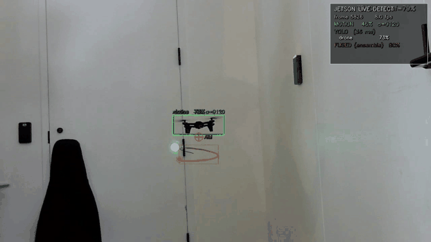
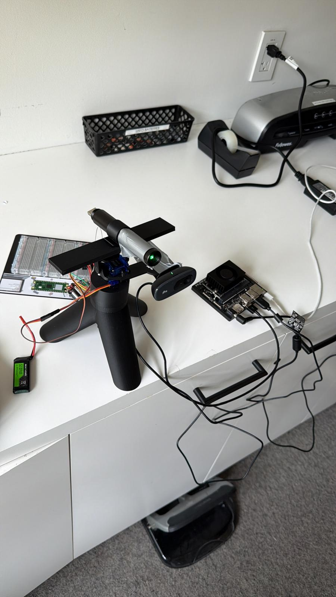
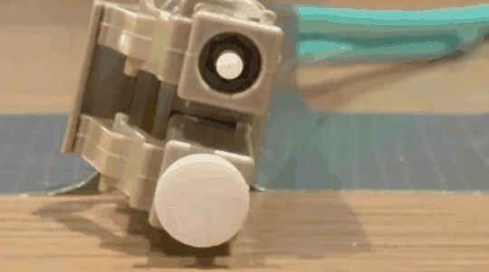

# BlackFiber — FOG Drone Fiber-Tether Neutralization System

> **One sentence:** Jammers don't work on Fiber-Optic-Guided drones.
> We don't jam — we corrupt the optical channel by damaging the fiber's
> cladding with a precision laser, dropping the control link in
> milliseconds.
>
> National Security Hackathon 2026 · Palantir track · Built on CASK.

---

## Live demo

[](https://youtu.be/Dcbhx9owgbg)

> ▶ **[Full demo on YouTube](https://youtu.be/Dcbhx9owgbg)** — narrated,
> with the dashboard, calibration, and live engagement.

Inline preview (5 s loop, generated from the bench-rig run):



> Closed-loop run on the bench rig: drone-trained YOLOv8 on a Jetson
> CASK, pixel-to-servo IDW calibration, and a 100 Hz host-side
> trapezoidal motion profile driving a Pico-controlled gimbal that
> sweeps the laser in a controlled lissajous under the airframe — over
> the fiber tether's exit zone.
>
> Full-quality MP4 (3.8 MB, 720p): [DroneKill.mp4](DroneKill.mp4)
> · open it from the file list above and click **View raw** to download.

---

## The hardware



> The full physical stack: USB camera on a 2-axis pan/tilt mount above
> a 28BYJ-48 base-rotation stepper, laser module rigidly co-located
> with the camera, all driven by a Raspberry Pi Pico W on the side.
> The Jetson CASK lives off-frame at the end of the USB cable. Total
> kit fits in a backpack — that's the PS2 "austere edge" picture.

## Optical-injection proof



> Bench-top proof that the cladding-breach mechanism is real and not
> theatre: BlackFiber's laser is held against a live POF tether; on
> the receive side, the photodetector and signal monitor degrade
> from clean carrier to total loss of total internal reflection.
> No fiber severing — just cladding scratch.
>
> Full clip (4.7 MB, 25 s, audio narration):
> [optical_injection_proof.mp4](optical_injection_proof.mp4)
> · click **View raw** to download.

---

## The thesis

**RF silence is a positive identifier of a FOG drone.** They're immune
to jamming, GPS spoofing, and high-power microwave because they carry no
RF signature — that's the whole point of fiber. The defense industry's
current frontline answer to FOG drones in Ukraine is *literal barbed
wire stretched across fields.* We do better.

The novel insight: **you don't have to sever the fiber.** Total internal
reflection in the core depends on an intact cladding. Breach the
protective jacket, scratch the cladding, and the optical channel
immediately bleeds light out and ambient light in. Bit-error-rate spikes
past the FEC threshold, control link drops, drone enters failsafe.
A laser pointer is enough.

## How the system works

```
                ┌───────────────────────────────────────────┐
                │  Camera (USB) on pan/tilt + base-rotation │
                │  gimbal (28BYJ-48 stepper underneath)     │
                └─────────────┬─────────────────────────────┘
                              ▼
        ┌─────────────────────────────────────────┐
        │  Detection: OpenCV motion + YOLOv8      │
        │  ensemble (drone-fine-tuned weights).   │
        │  Output: drone bounding box.            │
        └─────────────┬───────────────────────────┘
                      ▼
        ┌─────────────────────────────────────────┐
        │  Aim point = bbox bottom-center;        │
        │  SweepPlanner overlays a small          │
        │  figure-8 lissajous around it (the      │
        │  laser PAINTS that 8-shape on the       │
        │  fiber, not just a single dot).         │
        └─────────────┬───────────────────────────┘
                      ▼
        ┌─────────────────────────────────────────┐
        │  Pixel → (pan, tilt, base-rotation)     │
        │  via IDW calibration map.               │
        │  GimbalDriver background thread runs    │
        │  a trapezoidal motion profile (accel    │
        │  + velocity capped) at 100 Hz so the    │
        │  servos NEVER receive a teleport        │
        │  command, regardless of detection FPS.  │
        └─────────────┬───────────────────────────┘
                      ▼
        ┌─────────────────────────────────────────┐
        │  Pico W drives PWM (servos) +           │
        │  half-step coil sequence (28BYJ-48 via  │
        │  ULN2003). Photodetector reports fiber  │
        │  signal level. PIR sensor reports any   │
        │  bystander in front of the rig (safety  │
        │  interlock, observe-only for now).      │
        └─────────────┬───────────────────────────┘
                      ▼
        ┌─────────────────────────────────────────┐
        │  Engagement logged as DroneEngagement   │
        │  ontology object → Foundry (when up) +  │
        │  local JSONL (always).                  │
        └─────────────────────────────────────────┘
```

Same stack runs on a Palantir CASK (Jetson) at the edge — fully
autonomous when the network is down, syncs to Foundry when it's up.
The Mac is used as the operator UI (calibration, MJPEG stream viewer,
ENGAGE LASER toggle); the Jetson does all real-time work.

## Repository layout

```
BlackFiber/                      # (clones as 'Katena/' if you keep the legacy repo name)
├── macbook/                     # Detection + sweep + UI (Python 3.11)
│   ├── detector.py              # MOG2 + YOLOv8 ensemble (YOLO-priority fusion)
│   ├── tracker.py               # Kalman-style predictor + lead point
│   ├── sweep.py                 # Lissajous "figure-8" sweep planner + EWMA smoothing
│   ├── fire_state.py            # Tracking → Armed → Cooldown state machine
│   ├── aim_filter.py            # Per-axis aim smoothing
│   ├── calibration.py           # Inverse-Distance-Weighting pixel→servo map
│   ├── calibration_tool.py      # Click-to-anchor tool (camera + Pico same machine)
│   ├── streaming.py             # MJPEG server + browser ENGAGE LASER toggle
│   ├── serial_link.py           # Host-side Pico wire protocol
│   ├── state_machine.py         # SEARCHING → TARGET → RF-SILENCE → ENGAGING
│   ├── engagement.py            # DroneEngagement ontology object
│   ├── logger.py                # Local JSONL log + Foundry sync
│   ├── overlay.py               # All on-screen HUD elements
│   ├── main_tracker.py          # Mac-side full pipeline entry point
│   └── config.py
│
├── pico/                        # MicroPython firmware (runs on Pico W)
│   ├── pico_controller.py       # PWM servos + 28BYJ-48 stepper + sensors + telemetry
│   ├── firmware/                # MicroPython .uf2 ready to flash
│   └── README.md                # Pin map + flashing + serial protocol
│
├── jetson/                      # CASK / Jetson bootstrap + verification
│   ├── setup_jetson.sh          # One-shot environment setup
│   ├── verify_jetson.py         # Hardware/driver smoke test
│   └── README.md                # SSH, transfer, troubleshooting
│
├── scripts/                     # Operational tooling
│   ├── jetson_live_detect.py    # ★ Closed-loop runtime: cam + YOLO + sweep + Pico
│   ├── calibration_remote.py    # ★ Mac-side calibration: MJPEG ← Jetson, SSH→Pico
│   ├── pico_bridge.py           # stdin↔serial bridge (used by calibration_remote over SSH)
│   ├── teleop_pico.py           # Slow/safe WASD teleop for the gimbal
│   ├── teleop_dashboard.py      # Live JSONL dashboard for teleop
│   ├── pir_dashboard.py         # PIR safety-interlock live view
│   ├── replay_video.py          # Run a recorded clip through the live pipeline
│   ├── jetson_record_clip.py    # Record raw camera clips for offline replay
│   ├── train_drone_yolo.py      # Fine-tune YOLOv8n on the Seraphim drone dataset
│   ├── eval_drone_detector.py   # Score a checkpoint vs. validation set
│   ├── download_drone_dataset.py
│   ├── seed_engagements.py      # Pre-mint demo data for the dashboard
│   ├── verify_*.py              # camera / yolo / serial / foundry / all
│   └── run_tests.sh             # Compile + tests (+ optional smoke) gate
│
├── tests/                       # 156 unit tests, ~3s, no hardware needed
├── dashboard.py                 # Streamlit local twin of the Foundry view
├── Makefile                     # `make tracker`, `make calibrate`, `make test`, ...
├── pyproject.toml               # pytest + coverage config
├── requirements.txt             # Frozen dep set
├── .env.example                 # Foundry creds template (real .env is gitignored)
├── paper/                       # LaTeX physics writeup (cladding-breach math)
└── recordings/                  # Demo clips + screenshots (gitignored)
```

## End-to-end runtime (the Demo Day path)

This is the actual command sequence. Two machines: a **Mac** for the
operator UI, and the **Jetson** (`cask`) wired to the camera + Pico.

### 1. Calibrate (one time per physical rig)

On the Jetson, expose a clean camera-only MJPEG stream:

```bash
ssh cask
cd ~/Katena
./scripts/start_live.sh \
    --rotate-180 \
    --no-yolo \
    --motion-min-area 99999 \
    --mjpeg
```

Open an SSH tunnel for the MJPEG port:

```bash
ssh -fN -L 8765:127.0.0.1:8765 cask
```

On the Mac, run the calibration UI:

```bash
python scripts/calibration_remote.py --ssh cask
```

Then in the cv2 window:

- **JOG mode (default):** `WASD` jogs the laser. When the dot is on a
  known target in the scene, **left-click** that pixel. Capture
  9–11 anchors covering all four corners + center.
- **`t` toggles TRACK CURSOR mode:** the laser continuously aims at
  whatever pixel your mouse is over. This is the live verification —
  drag the mouse around, watch the laser follow, sanity-check that
  edges and corners feel right.
- **LOO residuals** show in the corner overlay (green < 2°, amber 2–5°,
  red > 5°). Any red anchor is inconsistent with its neighbors —
  either delete it or recapture.
- **`f` saves** to `./calibration.json` on the Mac.
- Then push to the Jetson: `scp calibration.json cask:~/Katena/calibration.json`

### 2. Run the closed-loop pipeline

On the Jetson:

```bash
ssh cask
cd ~/Katena
./scripts/start_live.sh \
    --rotate-180 \
    --pico-port /dev/ttyACM0 \
    --cal calibration.json \
    --mjpeg
```

Defaults that matter:

| Flag | Default | What it controls |
| --- | --- | --- |
| weights | `~/Katena/drone_best.pt` if present, else `yolov8n.pt` | YOLO model |
| `--pico-max-slew-deg-s` | 90 | Max angular **velocity** of the gimbal |
| `--pico-max-accel-deg-s2` | 360 | Max angular **acceleration** (this is the smoothness dial) |
| `--pico-driver-rate-hz` | 100 | Background actuator thread tick rate |
| `--pico-rate-hz` | 30 | Max command rate sent to the Pico |
| `--pico-max-rot-slew-deg-s` | 120 | Same, for the base-rotation stepper |
| `--pico-track-mode` | `tracking` | Whether the gimbal follows in TRACKING (pre-arm) too |

On the Mac, open the MJPEG stream in a browser:

```bash
ssh -fN -L 8765:127.0.0.1:8765 cask
open http://localhost:8765
```

The browser page has an **ENGAGE LASER** toggle. The gimbal stays
parked at the calibration center until you click it — overlays and
detections still render so you can dry-run with no movement.

### 3. State you'll see on screen

- **SEARCHING** — no detection
- **TARGET ACQUIRED** — fused detection above confidence threshold
- **TRACKING** — predictor lock + gimbal aiming, laser off
- **LOCKED** — `FireController` armed; sweep planner traces the
  figure-8 over the fiber-exit zone
- **COOLDOWN** — post-engagement, brief lockout

## Smooth-motion architecture (why the gimbal isn't jittery)

Two things kept biting us before this iteration:

1. **Bursty motion** when YOLO ran at 6 fps — the gimbal stepped once
   per detection, so 167 ms gaps were visible to the eye.
2. **"Bang-bang" velocity** — the slew limiter capped angular speed
   but allowed instantaneous velocity changes (0 → 90 °/s in one
   frame), which made cheap servos visibly twitch.

Both are now solved by `GimbalDriver` (in
[`scripts/jetson_live_detect.py`](scripts/jetson_live_detect.py)):

- A **background thread ticks at 100 Hz**, decoupled from the
  detection rate. The detection loop just calls
  `driver.set_target(pan, tilt, rot, mode)` whenever it has a new
  desired aim.
- Each tick runs a **trapezoidal motion profile per axis**:
  velocity ramps up at most `a_max·dt` per tick, cruises at `v_max`,
  then decelerates along the `√(2·a_max·|error|)` envelope so the
  servo lands on target without overshoot.
- Commands are sent to the Pico at a separate rate cap (`30 Hz` by
  default) so the serial link is never flooded.

End result: even when the upstream detector is at 6 fps, the gimbal
moves continuously at 100 Hz with smooth acceleration.

## Operator tooling

| Script | What it's for |
| --- | --- |
| `scripts/jetson_live_detect.py` | Main runtime. Camera + detection + sweep + Pico. |
| `scripts/calibration_remote.py` | Click-to-anchor calibration UI on Mac, controlling Jetson over SSH. Includes live TRACK CURSOR mode + LOO residual coloring. |
| `scripts/teleop_pico.py` | WASD teleop, host-side rate-limited so cheap servos don't strain. |
| `scripts/teleop_dashboard.py` | Live JSONL dashboard of teleop state. |
| `scripts/pir_dashboard.py` | Visualizes the PIR / Fresnel safety interlock. |
| `scripts/replay_video.py` | Run any recorded clip through the live pipeline (great for tuning). |
| `scripts/jetson_record_clip.py` | Record raw camera clips for later replay. |
| `scripts/train_drone_yolo.py` | Fine-tune YOLOv8n on the Seraphim drone dataset. |

The MJPEG server (`macbook/streaming.py`, hosted by
`jetson_live_detect.py`) exposes:

- `GET /` — live preview page with the **ENGAGE LASER** toggle
- `GET /stream` — `multipart/x-mixed-replace` MJPEG stream
- `POST /laser/toggle` — flip engagement
- `GET /laser/status` — current state JSON

## Quickstart (MacBook)

```bash
cd ~/Desktop/Katena
source .venv/bin/activate

make test           # 156 unit tests, ~3s, no hardware needed
make tracker        # full pipeline against laptop webcam in mock-Pico mode
make calibrate      # local calibration tool (camera + Pico same machine)
make dashboard      # Streamlit ops dashboard
make seed           # pre-seed dashboard with demo engagements
make smoke          # camera + YOLO + serial + Foundry live checks
make help           # all available commands
```

Before each commit:

```bash
bash scripts/run_tests.sh        # syntax + unit tests, < 5s
bash scripts/run_tests.sh --smoke # also exercises camera/YOLO/serial/Foundry
```

### Configure Foundry

```bash
cp .env.example .env
# edit .env: fill in FOUNDRY_URL and FOUNDRY_TOKEN from the Developer Console
python scripts/verify_foundry.py
```

### Flash the Pico W

See `pico/README.md`. tl;dr: hold BOOTSEL, plug in USB, drag
`pico/firmware/RPI_PICO_W-20260406-v1.28.0.uf2` onto the `RPI-RP2`
drive that appears, then drop `pico/pico_controller.py` on as `main.py`.

### Set up the CASK / Jetson

See `jetson/README.md`. tl;dr: SSH in, `rsync` the project over,
`bash jetson/setup_jetson.sh`, then `python3 jetson/verify_jetson.py`.

The Jetson also expects `~/Katena/scripts/start_live.sh` — a small
wrapper that exports the right `LD_LIBRARY_PATH` for CUDA (cuBLAS,
cuDNN, NVRTC) and then exec's `jetson_live_detect.py`. Without it,
YOLO fails at import time with `libcudss.so.0: cannot open shared
object file`.

## Tech stack

| Layer | Tool |
| --- | --- |
| Compute (primary) | MacBook Air M5 (Apple Silicon, Metal/MPS) |
| Compute (edge) | Palantir CASK on NVIDIA Jetson |
| Vision | OpenCV 4.13 + YOLOv8n (Ultralytics 8.4), drone-fine-tuned |
| Pan/tilt servos | 2× 9G hobby servos on Pico W PWM (50 Hz) |
| Base rotation (XOY plane) | 28BYJ-48 stepper + ULN2003, half-step driven by Pico |
| Servo / stepper control | Pico W running MicroPython 1.28 |
| Safety interlock | PIR (Fresnel) sensor on Pico GP4 (observe-only for now) |
| Ontology / sync | Palantir Foundry + OSDK (Embedded Ontology) |
| Local dashboard | Streamlit |
| Optional sensor | RTL-SDR for RF-silence FOG confirmation |

## Demo flow

1. Suspended drone with POF tether visible to photodetector.
2. Live MJPEG (in browser) with state-machine overlay:
   `SEARCHING` → `TARGET ACQUIRED` → `RF SILENCE — FOG CONFIRMED` →
   `ENGAGING`.
3. Operator clicks **ENGAGE LASER** in the browser. Gimbal smoothly
   tracks; `SweepPlanner` traces a figure-8 over the fiber-exit zone.
4. Pre-recorded close-up of the laser hitting the fiber + signal
   monitor degrading 100 % → 0 %.
5. Live: `FIBER COMPROMISED` flashes, buzzer triggers,
   `DroneEngagement` object appears on the Foundry Workshop dashboard.
6. **Network kill switch.** System keeps detecting and engaging.
7. Restore network. Queued offline engagements sync to Foundry.

## Status

| Component | State |
| --- | --- |
| Python env, deps, YOLO weights | done |
| Project scaffolding + verification scripts | done |
| MicroPython firmware on the Pico W | done |
| `macbook/main_tracker.py` (full Mac-side pipeline) | done |
| `pico/pico_controller.py` (servos + stepper + sensors + telemetry) | done |
| YOLOv8 drone fine-tune (`drone_best.pt`) | done, deployed to Jetson |
| Detection ensemble with YOLO-priority fusion | done |
| `SweepPlanner` figure-8 + EWMA smoothing + sub-frame interpolation | done |
| `FireController` arming state machine | done |
| `MJPEGServer` + browser ENGAGE LASER toggle | done |
| IDW calibration + remote click-to-anchor UI (Mac ↔ Jetson) | done |
| Live TRACK-cursor verification + LOO residual coloring | done |
| Closed-loop laser pointing through calibration | done |
| GimbalDriver: 100 Hz background thread + trapezoidal motion profile | done |
| WASD teleop + dashboard | done |
| PIR safety-interlock telemetry + dashboard (observe-only) | done |
| Jetson bootstrap + CUDA-aware launcher (`start_live.sh`) | done |
| 156 unit tests covering host + firmware + protocol | done |
| Foundry: object types defined | pending |
| Foundry: OSDK client generated | pending |
| Pan/tilt + stepper field calibration on the demo rig | iterating |
| `paper/main.tex` (physics writeup) | optional |
